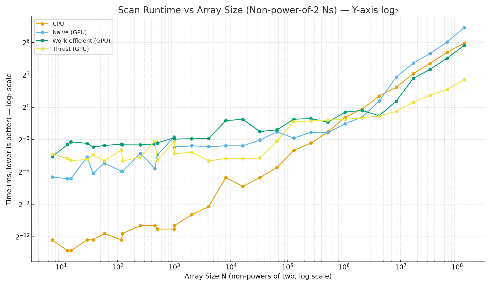
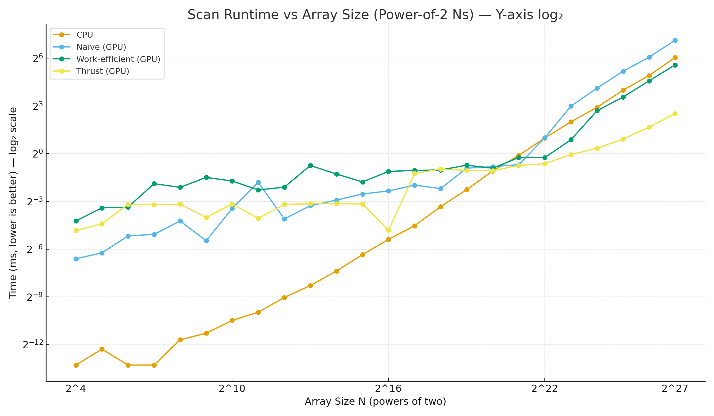
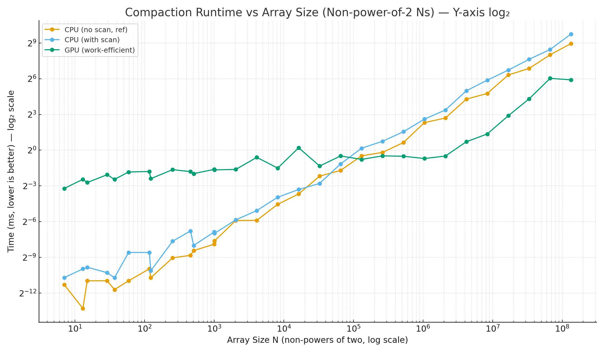
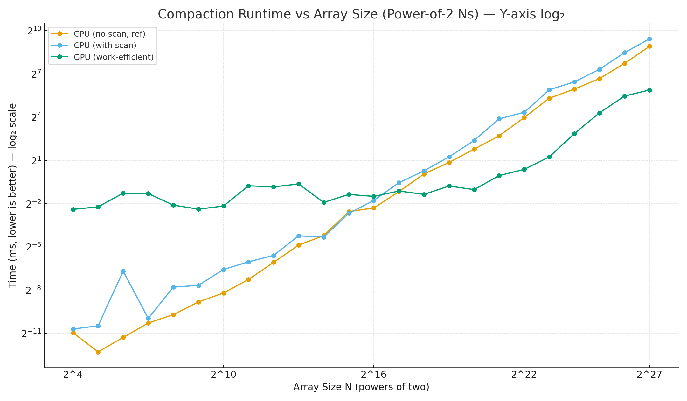
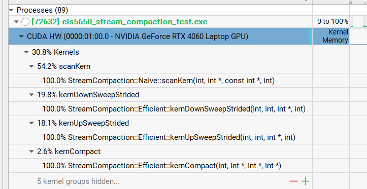

CUDA Stream Compaction
======================

**University of Pennsylvania, CIS 565: GPU Programming and Architecture, Project 2**

* Lijun Qu
  * [LinkedIn](https://www.linkedin.com/in/lijun-qu-398375251/), [personal website](www.lijunqu.com), etc.
* Tested on: Windows 11, i7-14700HX (2.10 GHz) 32GB, Nvidia GeForce RTX 4060 Laptop


## Implementation Overview

This project implements exclusive scan (prefix sum) and stream compaction on both CPU and GPU, with support for non-power-of-two sizes. The codebase includes a simple CPU baseline, a naïve GPU scan using ping-pong buffers, a work-efficient Blelloch scan that also powers GPU compaction, and a Thrust baseline for comparison. All measurements use compute-only timing in Release builds with a fixed blockSize = 128.

### Scan Methods

The CPU scan serves as a correctness oracle and baseline. It computes an exclusive prefix sum with identity 0 using a straightforward loop and is used to verify all GPU outputs.

The naïve GPU scan performs O(NlogN) work across ilog2ceil(N) rounds. It alternates between two global buffers to avoid read/write hazards and converts to exclusive form by shifting right and inserting 0 at the front.

The work-efficient GPU scan implements the Blelloch algorithm (GPU Gems 3 §39.2.2) with an up-sweep reduction, zeroing the last element, and a down-sweep to propagate exclusive sums. Arrays are padded to the next power of two so the binary tree remains well-formed; out-of-range lanes read zero. This method achieves O(N) work and is suitable for in-place operation within a padded buffer.

The Thrust version wraps thrust::exclusive_scan on device vectors to avoid timing host↔device copies. It serves as a high-performance reference, typically approaching memory-bandwidth limits for medium and large inputs.

### Stream Compaction

The CPU “without scan” variant performs a single pass and copies only values that satisfy the predicate (x != 0), which is extremely efficient for small arrays. The CPU “with scan” variant demonstrates the generic map→scan→scatter pattern on the host: it builds a boolean mask, runs an exclusive scan over that mask, and scatters survivors to their exclusive indices; this clarity comes at the cost of an extra pass.

The GPU compaction uses the work-efficient pipeline entirely on device. Data are first mapped to a {0,1} mask (x != 0), then an exclusive Blelloch scan over the mask produces write indices, and finally a scatter writes each kept element to out[scan[i]] wherever mask[i] == 1. The compacted length is scan[N−1] + mask[N−1]. This design is race-free by construction and becomes bandwidth-bound for large inputs.

### GPU Compaction Approach

Development followed a low-risk bring-up path: validate the mask kernel on adversarial inputs (all-zeros/ones, alternating, head/tail zeros, non-power-of-two), reuse the already-correct exclusive scan to turn that mask into indices, and then confirm scatter correctness by checking that only positions with mask[i] == 1 are written and that the final count matches scan[N−1] + mask[N−1]. Padding to the next power of two guarantees a clean tree for the scan while leaving values outside the original range inert.

### Correctness & Edge Cases

All implementations were validated against the CPU exclusive scan on empty arrays, all-zeros, all-ones, alternating patterns, head/tail zeros, random data, and non-power-of-two lengths. GPU scans produce exclusive results matching the CPU baseline exactly, and the compaction count formula scan[N−1] + mask[N−1] holds across cases.


## Performance Analysis (Scan & Stream Compaction)


### Scan — Non-power-of-two Ns



With blockSize = 128 and timing that excludes host↔device copies, the non-power-of-two curve makes the trade-offs very clear. For tiny inputs, the CPU’s cache-friendly for-loop wins because any GPU kernel launch and global-memory synchronization costs completely dominate the actual arithmetic. As soon as the arrays reach the “real work” regime, Thrust pulls ahead and stays ahead: its implementation (backed by highly tuned primitives) keeps the number of full-array passes to the minimum and keeps those passes bandwidth-limited rather than launch-limited. The work-efficient GPU scan tracks Thrust’s shape but is consistently slower on ragged sizes because it must pad to the next power of two and then pay branching/guard costs on the edges during the up-sweep/down-sweep. The naïve scan degrades fastest as N grows; it performs O(NlogN) total work via many global passes and therefore burns additional memory bandwidth each round. Put differently: on non-PoT Ns, you can almost read the cost of padding and extra passes directly off the slope—Thrust amortizes it best, work-efficient is second, and naïve pays the full penalty.


### Scan — Power-of-two Ns



On exact powers of two, the picture tightens. The work-efficient algorithm no longer wastes cycles on ragged tails, so it closes much of the gap to Thrust; both become strongly bandwidth-bound and scale smoothly. CPU still rules the tiny-N corner, but once you cross the small-array threshold, the GPU methods clearly take over. The naïve curve is the tell: although it benefits from perfect tree alignment too, it still requires extra global passes and therefore never quite catches the work-efficient curve. Practically, this means that if you can align batch sizes or pad once up front and keep the data on device, you get very close to Thrust-level performance with your own work-efficient kernel, whereas the naïve scan remains a teaching baseline rather than a contender.


### Stream Compaction — Non-power-of-two Ns



Compaction is “map → scan → scatter,” so the scan behavior largely dictates the outcome. For small Ns, CPU w/o scan (reference) is excellent: it touches each element once, branches predictably, and writes compacted output without any kernel overhead. CPU with scan is slower because it pays for an extra pass plus a scatter on a single core. As N grows, GPU work-efficient compaction catches and then surpasses the CPU curves despite padding; the boolean map is embarrassingly parallel, the scan is the only truly synchronization-heavy stage, and the scatter becomes another bandwidth-friendly pass so long as you compute indices via an exclusive scan. The overall shape matches the scan plot: the moment the scan becomes cheaper on the GPU than on the CPU, the whole compaction pipeline flips in the GPU’s favor even on ragged sizes.


### Stream Compaction — Power-of-two Ns



On powers of two, work-efficient GPU compaction wins decisively once arrays become moderate in size. With no ragged tiles, there is less branching and better warp utilization during both up-sweep and down-sweep; scatter writes are also more uniformly coalesced because exclusive indices are generated without padding holes. The CPU lines grow roughly linearly in milliseconds, while the GPU line remains flat for a long span and then scales gently with bandwidth. In other words: when the data layout matches the tree, compaction becomes a textbook two-or-three-pass, memory-bound pipeline that the GPU is built to execute.


### Interpretation & Bottlenecks (Why the curves look like this)

Across all plots, the crossover point is governed by two things: 

(1) fixed overheads—kernel launches, global synchronizations, and any temporary allocations; and 

(2) the number of full-array passes you force through device memory. 


For tiny inputs, overheads dominate; for large inputs, memory bandwidth dominates. The naïve scan does more work than necessary (extra passes), so its slope is steeper. The work-efficient scan minimizes arithmetic, but on non-PoT Ns it still pays for padding and branch guards, which is why it sits between naïve and Thrust. Thrust is near the “best you can do” for a generic device-wide scan because it orchestrates a small, fixed set of kernels, maximizes coalescing, and reuses temporary storage efficiently. In compaction, the CPU “no-scan” method shines for small sizes because it is a single pass with predictable branching, but the GPU work-efficient pipeline takes over as soon as scan+scatter become cheaper than the CPU’s branchy walk. All results above were gathered in Release, blockSize = 128, V-Sync off, and device-only timing windows, so the comparisons are apples-to-apples.


### Nsight Kernal Memory Analysis



From this Nsight capture, almost all GPU time is consumed by scan, not scatter: about 54% sits in the naïve scanKern, roughly 20% in the work-efficient down-sweep and 18% in the up-sweep, while the actual compaction scatter (kernCompact) is only ~2.6%. That breakdown matches the theory: the naïve scan performs O(NlogN) full-array passes and therefore dominates when it’s included, whereas the work-efficient phases are nicely balanced and largely memory-bandwidth-bound (two structured passes over padded data). The tiny, hidden kernel groups are almost certainly the boolean map, the “set last = 0” step between phases, and small padding helpers. Net read: the timeline reflects that scan—not scatter—is the limiting stage, the naïve path inflates total kernel time due to extra passes, and the efficient up/down sweeps split the remaining cost in a way that indicates regular, coalesced traffic rather than heavy synchronization.

### Output of test program (for block size of 128)
```

****************
** SCAN TESTS **
****************
    [   3  34  22   3  45  34  31   6   0  36   8  34  19 ...  18   0 ]
==== cpu scan, power-of-two ====
   elapsed time: 0.0005ms    (std::chrono Measured)
    [   0   3  37  59  62 107 141 172 178 178 214 222 256 ... 5790 5808 ]
==== cpu scan, non-power-of-two ====
   elapsed time: 0.0004ms    (std::chrono Measured)
    [   0   3  37  59  62 107 141 172 178 178 214 222 256 ... 5735 5758 ]
    passed
==== naive scan, power-of-two ====
   elapsed time: 0.15872ms    (CUDA Measured)
    passed
==== naive scan, non-power-of-two ====
   elapsed time: 0.119808ms    (CUDA Measured)
    passed
==== work-efficient scan, power-of-two ====
   elapsed time: 0.344064ms    (CUDA Measured)
    passed
==== work-efficient scan, non-power-of-two ====
   elapsed time: 0.162912ms    (CUDA Measured)
    passed
==== thrust scan, power-of-two ====
   elapsed time: 0.1024ms    (CUDA Measured)
    passed
==== thrust scan, non-power-of-two ====
   elapsed time: 0.048128ms    (CUDA Measured)
    passed

*****************************
** STREAM COMPACTION TESTS **
*****************************
    [   1   0   0   1   3   0   3   0   2   2   0   0   3 ...   2   0 ]
==== cpu compact without scan, power-of-two ====
   elapsed time: 0.0011ms    (std::chrono Measured)
    [   1   1   3   3   2   2   3   2   3   2   3   1   1 ...   3   2 ]
    passed
==== cpu compact without scan, non-power-of-two ====
   elapsed time: 0.0007ms    (std::chrono Measured)
    [   1   1   3   3   2   2   3   2   3   2   3   1   1 ...   1   3 ]
    passed
==== cpu compact with scan ====
   elapsed time: 0.0035ms    (std::chrono Measured)
    [   1   1   3   3   2   2   3   2   3   2   3   1   1 ...   3   2 ]
    passed
==== work-efficient compact, power-of-two ====
   elapsed time: 0.305152ms    (CUDA Measured)
    [   1   1   3   3   2   2   3   2   3   2   3   1   1 ...   3   2 ]
    passed
==== work-efficient compact, non-power-of-two ====
   elapsed time: 0.195584ms    (CUDA Measured)
    [   1   1   3   3   2   2   3   2   3   2   3   1   1 ...   1   3 ]
    passed

```